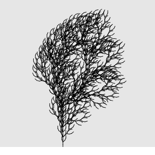
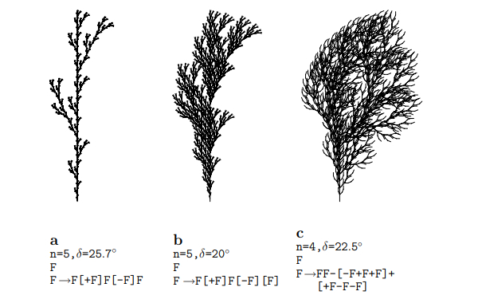
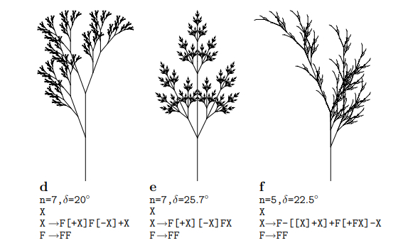

# L-systems

In 1968, Hungarian botanist Aristid Lindenmayer developed a grammar-based system to model the growth patterns of plants.

This technique can be used to generate the recursive fractal patterns.

## Components

An L-system has three main components:
- __Alphabet__: An L-system’s alphabet comprises the valid characters that can be included.
- __Axiom__: The axiom is a sentence (created with characters from the alphabet) that describes the initial state of the system.
- __Rules__: The production rules of an L-system describe ways of transforming the sentence. Consta de un _predecesor_ y _sucesor_.

### Generations

El proceso de aplicar las reglas sucesivamente se denomina **Generación**.

- La **Generación-0** es el mismo axioma.
- Las subsiguientes **Generaciones** resultan de aplicar las reglas a la generación anterior.

Por ejemplo, consideremos:

```
Alphabet    A, B
Axiom       A
Rules       A → AB
            B → A

Generación	Statement
G-0     	A
G-1     	AB
G-2     	ABA
G-3     	ABAAB
...
```

## Turtle graphics

How Lindenmayer was able to translate strings of characters into the organic structures of plants.

Consideremos el alfabeto: `F, G, +, –, [ and ]`
donde, 
 `F`	Draw a line and move forward.
 `G`	Move forward (without drawing a line).
 `+`	Turn right.
 `–`	Turn left.
 `[`	Save current state.
 `]`	Restore current state.

> **Nota**: El ángulo de giro es arbitrario. 

This type of drawing framework is often referred to as __turtle graphics__.

### Generating a branched structure

Ejemplo:

```
Alphabet    F, G, +, –, [, ]
Axiom       F
Rules       F → FF+[+F–F–F]–[–F+F+F]
```

Aplicando 4 generaciones y angulo 22.5º, resulta:



Mas figuras:





## References

- *The Nature of Code - Fractals*: https://natureofcode.com/fractals/#l-systems
- *The Algorithmic Beauty of Plants* https://algorithmicbotany.org/papers/#abop

## Developer

- **Author**: *Carlos Ramos*
- **Linkedin**: https://www.linkedin.com/in/carlosramos05/
- **GitHub**: https://github.com/carlosfelipe14
